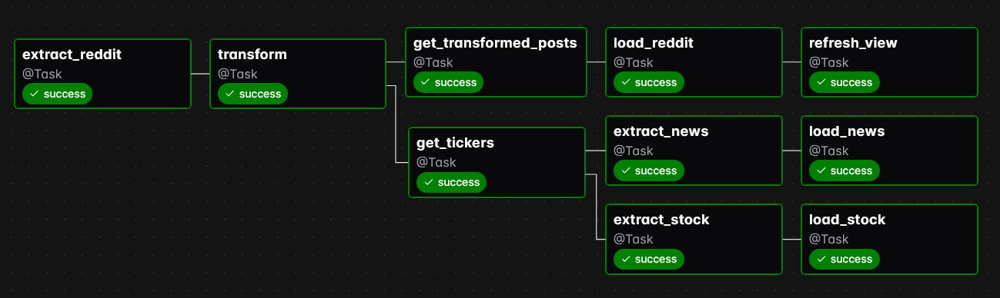

# Stonks - A Tool for Due Diligence (DD)

A comprehensive ETL pipeline that extracts stock discussions from Reddit, analyzes sentiment using FinBERT, fetches corresponding news and stock data, and loads everything into a PostgreSQL database for analysis.

## Features

- **Multi-Source Reddit Extraction**: Automatically pulls posts from popular stock subreddits like r/investing, r/wallstreetbets, and r/stocks
- **AI-Powered Sentiment Analysis**: Uses FinBERT (Financial BERT) model to analyze sentiment for mentioned stock tickers
- **Real-Time News Integration**: Fetches latest news articles for discovered tickers via News API
- **Historical Stock Data**: Retrieves stock price data and trading volumes via Alpha Vantage API
- **Automated ETL Pipeline**: Runs daily using Apache Airflow with task dependencies and error handling
- **Scalable Architecture**: Containerized with Docker for easy deployment and scaling
- **Optimized Database**: PostgreSQL with materialized views for fast analytics and reporting
- **Monitoring & Logging**: Built-in logging and Airflow UI for pipeline monitoring and debugging

## Core Tools & Technologies Used

- **Python**  
- **Apache Airflow**  
- **PostgreSQL**  
- **Docker**  

## Architecture

### Overall Architecture:


### Airflow DAG:




## Project Structure

Stonks/
├── dags/                             # Airflow DAG definitions  
│   ├── reddit_stock_pipeline_dag.py  # Main Airflow pipeline DAG  
│   └── dag_helper.py                 # Business logic used by DAG  
│  
├── extract/                          # Data extraction modules  
│   ├── reddit_data.py                # Reddit API integration  
│   ├── news_data.py                  # News data using News API   
│   ├── daily_stock_data.py           # Alpha Vantage stock price data  
│   ├── ticker_symbols.py             # Utility to extract stock tickers from text  
│   └── us_symbols.csv                # List of all US stock symbols  
│  
├── transform/                        # Data transformation layer  
│   └── sentiment.py                  # FinBERT-based sentiment analysis  
│  
├── load/                             # Data loading layer  
│   └── db_operations.py              # PostgreSQL DB insert/update logic  
│  
├── configs/                          # Configuration and setup scripts  
│   ├── db_connection.py              # PostgreSQL connection logic  
│   ├── db_init.sql                   # SQL schema definition for DB  
│   ├── praw_config.py                # Reddit API credentials/config  
│   └── logging_config.py             # Logging format and handlers  
│   
├── docker-compose.yml                # Docker Compose service definitions  
├── Dockerfile                        # Custom Dockerfile for Airflow image  
├── requirements.txt                  # Python dependencies  
└── .env                              # Environment variables   


## Quick Start

### Prerequisites

- Docker & Docker Compose
- Reddit API credentials
- Alpha Vantage API key
- News API key

## Setup

### 1. Clone the Repository

```bash
git clone https://github.com/SoyabKarki/Stonks
cd Stonks
```

### 2. Create Environment Variables

Create a `.env` file in the project root:

```env
# Reddit API Configuration
CLIENT_ID=<id>
CLIENT_SECRET=<secret>
CLIENT_USER_AGENT=stonks/1.0

# Database Configuration
POSTGRES_HOST=postgres
POSTGRES_DB=stonks_db
POSTGRES_USER=<user>
POSTGRES_PASSWORD=<password>
POSTGRES_PORT=5432

# Alpha Vantage API (for stock data)
ALPHA_VANTAGE_API_KEY=<key>

# News API
NEWS_API_KEY=<key>
```

### 3. Get API Keys

#### Reddit API
1. Go to [Reddit Apps](https://www.reddit.com/prefs/apps)
2. Click "Create App" or "Create Another App"
3. Choose "script" as app type
4. Note down your `client_id` and `client_secret`
5. For user agent, feel free to type in whatever you'd like!

#### Alpha Vantage API
1. Visit [Alpha Vantage](https://www.alphavantage.co/support/#api-key)
2. Get your free API key

#### News API
1. Visit [NewsAPI](https://newsapi.org/register)
2. Register and get your API key

### 4. Build and Run

```bash
# Build the Docker images (this may take about 20 minutes)
docker compose build

# Start all services
docker compose up -d

# Check if services are running
docker compose ps
```

## Database Schema

### Tables

- **`reddit_posts`**: Stores Reddit post metadata
- **`ticker_mentions`**: Stock tickers mentioned in posts with sentiment scores
- **`news_articles`**: News articles for mentioned tickers
- **`stock_data`**: Historical stock price data

### Views

- **`mv_ticker_mentions`**: Materialized view with aggregated ticker sentiment
- **`view_daily_sentiment_trends`**: Daily sentiment trends by ticker

### UML:


